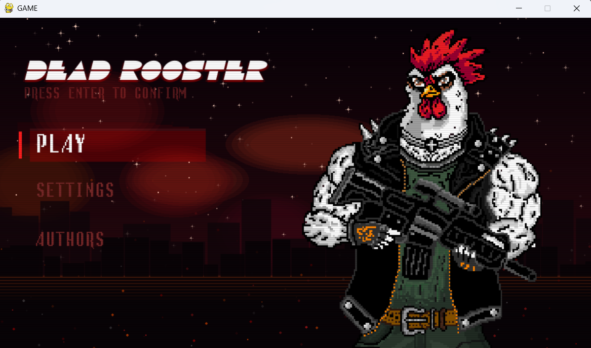

# 🐓 DEAD ROOSTER

**Dead Rooster** — учебный проект, top-down зомби-шутер на Python + Pygame.  
Вся графика, музыка и код созданы командой полностью с нуля.

---

## 🎮 Геймплей

Ты — одинокий боец на арене. Волна за волной на тебя идут зомби.  
Выживи все волны — и победишь. Умри — начинай заново.

---

## 🕹️ Управление

- **WASD** — движение
- **Мышь** — прицел
- **ЛКМ** — стрельба
- **BACKSPACE** — выход в меню

---

## ✨ Особенности

- 3 волны зомби, каждая сложнее предыдущей
- 2 типа врагов — обычный и быстрый зомби
- Анимация ходьбы, атаки зомби, крови
- Анимированное главное меню с частицами и сканлайнами
- Раздельная регулировка громкости музыки и звуковых эффектов
- Экран авторов с анимацией появления имён
- Секретная пасхалка на экране авторов

---

## 🚀 Запуск

**Требования:** Python 3.10+ и pygame-ce
```bash
pip install pygame-ce
python main.py
```

---

## 🗂️ Структура проекта
```
├── main.py        # Главное меню, настройки, авторы
├── game.py        # Игровой цикл, зомби, пули, волны
├── bg_scene.py    # Анимированный фон меню
├── fonts/         # Шрифты
├── image/         # Спрайты и фоны
└── music/         # Музыка и звуки
```

---

## 🛠️ Технологии

- Python 3
- pygame-ce 2.5+
- Вся 2D-графика нарисована вручную

---

## 👥 Авторы

- 🎨 **Дизайн:** Haidarhan Arman, Abzalbek Amirlan
- 💻 **Код:** Lood658, Baisakalov Daniil

---

## 📸 Скриншоты


.png)
.png)
.png)
